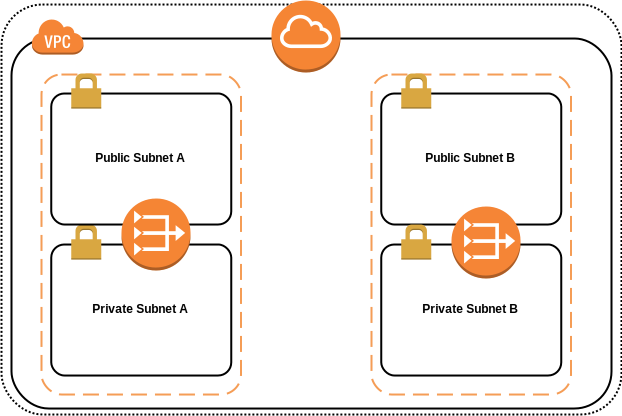
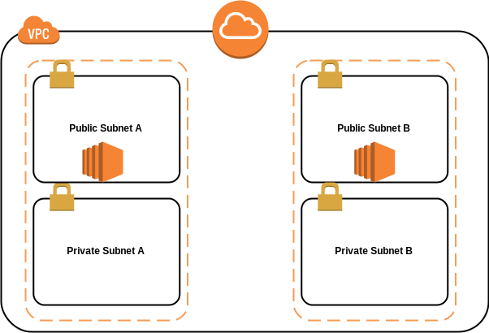
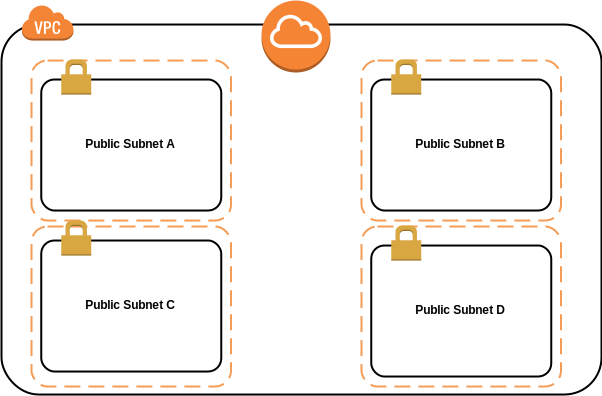

# Base VPC

El siguiente proyecto de terraform permite crear una VPC en [AWS Service](https://aws.amazon.com). 

# Variables importantes
Estas son las variables que se tienen que definir si o si para que el script funciones 
```
// Prefijo que se va a usar en la mayoria del los tags, se puede decir que es el nombre del ambiente/proyecto
name =  ""
// Region donde se va a implementar https://docs.aws.amazon.com/general/latest/gr/rande.html
region = ""
// CIDR block completo
cidr_block = ""
// Lista de las 4 subnets a utilizar
cidr_subnets  = [""]
// 4 Regiones 
region_az = []
```

Opcional

```
//  por defecto esta en false
assign_generated_ipv6=boolean
// tenancy, puede ser "default" o "dedicated", por defecto tenancy
tenancy=string
// tags que van a estar en todos los elementos a crear
tags= {
  default = {
    Created = "terraform"
  }
// Si se desea que la ip por defecto sea publico en las redes publicas, por defecto "false" 
public_subnet_map_public_ip_on_launch
```  


# Como hacer 2 redes publicas  y 2 privadas 
Estados dos variables tienen que estar definidas en **false**, en ambos casos estan por defecto con un valor de **false**
```
// Por defecto esta en false, asi que no es necesario definirla
public_subnet_map_public_ip_on_launch = false
// Por defecto esta definida en false 
has_private_subnet = true
```

## NAT GATEWAY
Las variable **has_nat_gateway** tiene que setearse en **true** las variables **has_egress_only_internet_gateway** y  **has_nat_instance** por defecto su valor es **false**

 
```
has_egress_only_internet_gateway = false
has_nat_instance = false
has_nat_gateway = true
```

## NAT INSTANCE

Las variable **has_nat_instance** tiene que setearse en **true** las variables **has_egress_only_internet_gateway** y  **has_nat_gateway** por defecto su valor es **false**

 

```
has_egress_only_internet_gateway = false
has_nat_instance = true
has_nat_gateway = false
```
## Egress-Only Internet Gateways

Las variable **has_egress_only_internet_gateway** y **assign_generated_ipv6 ** tienen que setearse en **true** las variables **has_nat_instance** y  **has_nat_gateway** por defecto su valor es **false**

 


```
assign_generated_ipv6 = true
has_egress_only_internet_gateway = false
has_nat_instance = true
has_nat_gateway = false
```

# Como hacer 4 redes publicas 

Todas esta variables deben de setearse en false, por defecto **has_private_subnet** esta definida como **true**, las demas por defecto en **false**

 
```
has_private_subnet = false
has_egress_only_internet_gateway = false
has_nat_instance = false
has_nat_gateway = false
```

